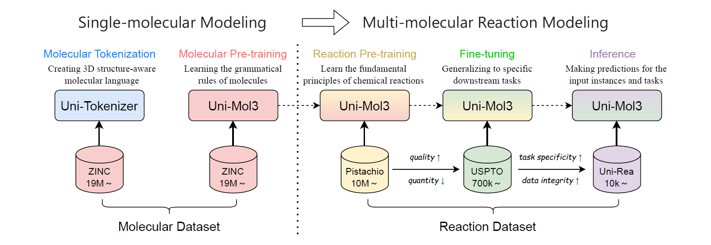

Uni-Mol3
==================================================================

### **A Multi-Molecular Foundation Model for Advancing Organic Reaction Modeling**


News
------------
- [x] [2025.07.18]   🎯📢   Now Uni-Mol3 is released!


Abstract
------------

<p align="center">
    
</p>

Building on the groundbreaking advancements by previous works Uni-Mol+ and Uni-Mol2, we introduce Uni-Mol3 — a novel deep learning model designed to extend their foundational frameworks to multi-molecular reaction modeling. Uni-Mol3 employs a hierarchical training procedure and data organization framework, in which molecular modeling is extended from the single- to the multi-molecule scale. For single-molecule modeling, we perform molecular tokenization and pre-training to create 3D structure-aware protein languages and learn molecular grammar rules, respectively. For multi-molecular modeling, we perform large-scale reaction pre-training to learn fundamental principles of chemical reactions, then fine-tune the model to generalize to specific downstream tasks, and finally make predictions for given input instances and tasks.


Dependencies
------------
 - [Uni-Core](https://github.com/dptech-corp/Uni-Core) with pytorch > 2.0.0, check its [Installation Documentation](https://github.com/dptech-corp/Uni-Core#installation).
 - rdkit==2022.09.5, install via `pip install rdkit==2022.09.5`


Dataset
------------

For all publicly accessible datasets, we provide details on data size, usage instructions, and preprocessed data (download links). 
| Data              | Data Size | Usage                     | Download Link                                                                               |
| ----------------- | --------- | ------------------------- | ------------------------------------------------------------------------------------------- |
| Ligands           | 114.76 GB | Uni-Tokenizer Training    | https://bioos-hermite-beijing.tos-cn-beijing.volces.com/unimol_data/pretrain/ligands.tar.gz |
| Ligands (tokens)  | 8.96 GB   | Molecular Pre-training    | https://drive.google.com/drive/folders/1xEaA2I-XxAMEpRFgwiE1wa2qKo45dDhK?usp=sharing        |
| USPTO-MIT         | 480 MB    | Forward Preaction         | https://drive.google.com/drive/folders/1yqfnN86B8LTJ-TZzg3sjLpD8OKoF5X4A?usp=sharing        |
| SMol-Reactions-FP | 137 MB    | Forward Preaction         | https://drive.google.com/drive/folders/1lWzGKpOQG8V-0YMB1dsXq6JY9hfe05_B?usp=sharing        |
| USPTO-50k         | 41.20 MB  | Retrosynthetic Prediction | https://drive.google.com/drive/folders/1x63mHF6AMUFTWafXtATJ1XUEp0WGVwNy?usp=sharing        |
| SMol-Reactions-RS | 122 MB    | Retrosynthetic Prediction | https://drive.google.com/drive/folders/1ku5Li-SxmdOnIR_2XtWaO9b7oAXjF1bE?usp=sharing        |
| USPTO-500-MT      | 148 MB    | Condition Generation      | https://drive.google.com/drive/folders/15HL7JD8sCjdJuovHoRfKm-vpQGYkMTje?usp=sharing        |
| USPTO-Condition   | 669 MB    | Condition Generation      | https://drive.google.com/drive/folders/18jhnM7ns1a66iGA0dj5JzYUWEA-oRAY5?usp=sharing        |
| Buchwald-Hartwig  | 5.99 MB   | Yield Prediction          | https://drive.google.com/drive/folders/1BKYdTro0l-sXccz6qq2ya62KPjMBE3cC?usp=sharing        |

Due to licensing constraints, Pistachio-related datasets — including Pistachio-full, Pistachio-FP, Pistachio-RS, and Pistachio-CG — cannot be publicly distributed. However, we make the corresponding data preprocessing scripts available; researchers with official access licenses to the Pistachio database can utilize these scripts to process data.


Uni-Mol3's pretrained model weights
----------------------------------

| Model                  | File Size | Update Date  | Download Link                                                                      |
|------------------------|-----------| -------------|----------------------------------------------------------------------------------- |
| Uni-Mol2               | 321 MB    | July 18 2025 | https://huggingface.co/dptech/Uni-Mol2/blob/main/modelzoo/84M/checkpoint.pt        |
| Uni-Tokenizer          | 1.44 GB   | July 18 2025 | https://drive.google.com/file/d/1WD9c2uDElcQhg0xikCo7_UWRDOlSsp0i/view?usp=sharing |
| Molecular Pre-training | 1.25 GB   | July 18 2025 | https://drive.google.com/file/d/1aSEBxP5cvIDB7aHRrIHr62GkHdkbGXUe/view?usp=sharing |
| Reaction Pre-training  | 1.25 GB   | July 18 2025 | https://drive.google.com/file/d/1gF7E7CKID_k7r9Np4gbLYGj9lvZxkdI5/view?usp=sharing |


Uni-Mol3's finetuned model weights
----------------------------------

| Model                                           | File Size| Update Date  | Download Link                                                                      |
|-------------------------------------------------|----------| ------------ |----------------------------------------------------------------------------------- |
| Pistachio_Pretrained_Forward (Seperated)        | 1.25 GB  | July 18 2025 | https://drive.google.com/file/d/1D7Z34GO5QQN3xxjH1-PYlg79s4y-xtpG/view?usp=sharing |
| Pistachio_Pretrained_Forward (Mixed)            | 1.25 GB  | July 18 2025 | https://drive.google.com/file/d/1UbRHZ_D6hJO0KKHiejHjGK30km5gtSsC/view?usp=sharing |
| Pistachio_Pretrained_Retrosynthetic             | 1.25 GB  | July 18 2025 | https://drive.google.com/file/d/1KYT_Q-pd0XT8zSm4xMxLh98VlMVnoOmH/view?usp=sharing |
| Pistachio_Pretrained_Condition                  | 1.25 GB  | July 18 2025 | https://drive.google.com/file/d/1Iz0f_v9E7I58D_VG4mNoviopar0sLkvE/view?usp=sharing |


Uni-Tokenizer Training 
------------

```
export NCCL_ASYNC_ERROR_HANDLING=1
export OMP_NUM_THREADS=1
export PYTHONDONTWRITEBYTECODE=1
export PROTOCOL_BUFFERS_PYTHON_IMPLEMENTATION=python
export MASTER_PORT=$1
[ -z "${n_gpu}" ] && n_gpu=$(nvidia-smi -L | wc -l)

data_path=$2
save_dir="./save_dir/tokenizer"
weight_path="./model/UniMol2_84M/checkpoint.pt"

lr=1e-4
wd=1e-4
warmup_steps=50000
max_steps=10000000

batch_size=32
update_freq=1
masked_token_loss=1
masked_coord_loss=1
masked_dist_loss=1
mask_prob=1.0
noise_type="uniform"
noise=0.2
seed=1

mask_token_prob=0.0
drop_feat_prob=0.5

ema_decay=0.999
[ -z "${droppath_prob}" ] && droppath_prob=0.1
[ -z "${pair_dropout}" ] && pair_dropout=0.25


timestamp=$(date '+%Y%m%d_%H%M%S')
branch=$(git branch --show-current)
commit_id=$(git rev-parse --short HEAD)
save_dir="${save_dir}/${timestamp}"
log_filename="training_log.txt"
mkdir -p $save_dir


torchrun --standalone --nnodes=1 --nproc_per_node=$n_gpu --master_port=$MASTER_PORT \
    $(which unicore-train) $data_path \
    --finetune-from-model $weight_path --tokenization True \
    --user-dir "unimol3" --train-subset train --valid-subset valid \
    --num-workers 8 --ddp-backend=no_c10d \
    --task unimol3_tokenizer --loss unimol3_tokenizer --arch unimol3_84M \
    --optimizer adam --adam-betas "(0.9, 0.99)" --adam-eps 1e-6 --clip-norm 1.0 --weight-decay $wd \
    --lr-scheduler polynomial_decay --lr $lr --warmup-updates $warmup_steps --total-num-update $max_steps \
    --update-freq $update_freq --seed $seed \
    --fp16 --fp16-init-scale 4 --fp16-scale-window 256 --tensorboard-logdir $save_dir/tsb \
    --max-update $max_steps --log-interval 10 --log-format simple \
    --validate-interval-updates 10000 --save-interval-updates 500000 --keep-interval-updates 10  \
    --validate-interval 1 --save-interval 1 --keep-last-epochs 0 \
    --masked-token-loss $masked_token_loss --masked-coord-loss $masked_coord_loss --masked-dist-loss $masked_dist_loss \
    --mask-prob $mask_prob --noise-type $noise_type --noise $noise --batch-size $batch_size \
    --mask-token-prob $mask_token_prob \
    --drop-feat-prob $drop_feat_prob \
    --droppath-prob $droppath_prob  \
    --pair-dropout $pair_dropout \
    --ema-decay $ema_decay --validate-with-ema \
    --max-epoch 80 \
    --tmp-save-dir $save_dir --save-dir $save_dir 2>&1 | tee ${save_dir}/${log_filename}
```


Molecular&Reaction Pre-training
------------

```
export NCCL_ASYNC_ERROR_HANDLING=1
export OMP_NUM_THREADS=1
export PYTHONDONTWRITEBYTECODE=1
export NCCL_NVLS_ENABLE=0
export MASTER_PORT=$1
export PROTOCOL_BUFFERS_PYTHON_IMPLEMENTATION=python
export TORCH_NCCL_HEARTBEAT_TIMEOUT_SEC=7200
[ -z "${n_gpu}" ] && n_gpu=$(nvidia-smi -L | wc -l)

cd /wulirong/Uni-Mol3
save_dir="./save_dir/pretrain"

wd=1e-4

batch_size=32
update_freq=1
seed=1

task_type=$2
if [ "$task_type" = "pretrain" ]; then
    max_steps=1000000
    lr=1e-4
    data_path='./data/ligands/3d_smiles/'
    arch="T5_base"
    warmup_steps=50000
    interval=100000
    weight_path='None'
    valid_set=valid
elif [ "$task_type" = "reaction" ]; then
    max_steps=1500000
    lr=1e-4
    data_path='./data/pistachio/full_data/'
    arch="T5_base"
    warmup_steps=50000
    interval=100000
    weight_path='./model/Molecule_Pretrained/checkpoint.pt'
    valid_set=valid
fi

timestamp=$(date '+%Y%m%d_%H%M%S')
branch=$(git branch --show-current)
commit_id=$(git rev-parse --short HEAD)
save_dir="${save_dir}/${timestamp}"
log_filename="training_log.txt"
mkdir -p $save_dir


torchrun --standalone --nnodes=1 --nproc_per_node=$n_gpu --master_port=$MASTER_PORT \
    $(which unicore-train) $data_path \
    --user-dir "unimol3" --train-subset train --valid-subset $valid_set \
    --num-workers 8 --ddp-backend=no_c10d \
    --task unimol3_T5 --loss unimol3_T5 --arch $arch \
    --optimizer adam --adam-betas "(0.9, 0.99)" --adam-eps 1e-6 --clip-norm 1.0 --weight-decay $wd \
    --lr-scheduler polynomial_decay --lr $lr --warmup-updates $warmup_steps --total-num-update $max_steps \
    --update-freq $update_freq --seed $seed \
    --fp16 --fp16-init-scale 4 --fp16-scale-window 256 --tensorboard-logdir $save_dir/tsb \
    --max-update $max_steps --log-interval 10 --log-format simple \
    --validate-interval-updates $max_steps --save-interval-updates $interval  --keep-interval-updates 10 \
    --validate-interval 50 --save-interval 1 --keep-last-epochs 0 \
    --batch-size $batch_size \
    --max-epoch 500 \
    --task-type $task_type \
    --weight-dir-path $weight_path \
    --tmp-save-dir $save_dir --save-dir $save_dir 2>&1 | tee ${save_dir}/${log_filename}
```


Downstream Fine-tuning 
------------

There are six different downstream  task types that can be specified by passing in different parameter *task_type*, including: (1) forward-sep&forward-mixed (Forward Prediction);  (2) reverse (Retrosynthetic Prediction);  (3) condtion (Condition Generation);  (4) yield (Yield Prediction);  (5) mixed (Multi-Tasking).

```
export NCCL_ASYNC_ERROR_HANDLING=1
export OMP_NUM_THREADS=1
export PYTHONDONTWRITEBYTECODE=1
export NCCL_NVLS_ENABLE=0
export MASTER_PORT=$1
export PROTOCOL_BUFFERS_PYTHON_IMPLEMENTATION=python
export TORCH_NCCL_HEARTBEAT_TIMEOUT_SEC=7200
[ -z "${n_gpu}" ] && n_gpu=$(nvidia-smi -L | wc -l)

cd /wulirong/Uni-Mol3
save_dir="./save_dir/finetune"

wd=1e-4
max_steps=1500000
epoch=5000

batch_size=64
update_freq=1
seed=1

task_type=$2
if [ "$task_type" = "yield" ]; then
    loss_func=unimol3_regression
else
    loss_func=unimol3_T5
fi

lr=5e-4
data_path='./data/pistachio/full_data/'
arch="T5_base"
warmup_steps=0
interval=100000
weight_path='./model/Reaction_Pretrained/checkpoint.pt'
valid_set=test_forward


timestamp=$(date '+%Y%m%d_%H%M%S')
branch=$(git branch --show-current)
commit_id=$(git rev-parse --short HEAD)
save_dir="${save_dir}/${timestamp}"
log_filename="training_log.txt"
mkdir -p $save_dir


torchrun --standalone --nnodes=1 --nproc_per_node=$n_gpu --master_port=$MASTER_PORT \
    $(which unicore-train) $data_path \
    --user-dir "unimol3" --train-subset train --valid-subset $valid_set \
    --num-workers 8 --ddp-backend=no_c10d \
    --task unimol3_T5 --loss $loss_func --arch $arch \
    --optimizer adam --adam-betas "(0.9, 0.99)" --adam-eps 1e-6 --clip-norm 1.0 --weight-decay $wd \
    --lr-scheduler polynomial_decay --lr $lr --warmup-updates $warmup_steps --total-num-update $max_steps \
    --update-freq $update_freq --seed $seed \
    --fp16 --fp16-init-scale 4 --fp16-scale-window 256 --tensorboard-logdir $save_dir/tsb \
    --max-update $max_steps --log-interval 10 --log-format simple \
    --validate-interval-updates $max_steps --save-interval-updates $interval --keep-interval-updates 10 \
    --validate-interval 20 --save-interval 1 --keep-last-epochs 0 \
    --batch-size $batch_size \
    --max-epoch $epoch \
    --task-type $task_type \
    --weight-dir-path $weight_path \
    --tmp-save-dir $save_dir --save-dir $save_dir 2>&1 | tee ${save_dir}/${log_filename}
```


Hyperparameter
------------


| Dataset                | max_steps | batch_size | lr   | weight_decay | epoch | lr-scheduler     |
| ---------------------- | --------- | ---------- | ---- | ------------ | ----- | ---------------- |
| USPTO-MIT              | 1000000   | 256        | 5e-4 | 1e-4         | -     | polynomial_decay |
| SMol-Reactions-FP      | 2000      | 256        | 5e-5 | 1e-4         | -     | fixed            |
| Pistachio-FP           | 1500000   | 512        | 5e-4 | 1e-4         | -     | polynomial_decay |
| USPTO-50k              | 20000     | 256        | 1e-4 | 1e-4         | -     | polynomial_decay |
| SMol-Reactions-RS      | 10000     | 256        | 1e-4 | 1e-4         | -     | fixed            |
| Pistachio-RS           | 1500000   | 512        | 5e-4 | 1e-4         | -     | polynomial_decay |
| USPTO-500-MT           | 32000     | 256        | 1e-4 | 1e-4         | -     | fixed            |
| USPTO-Condition        | 200000    | 256        | 1e-4 | 1e-4         | -     | fixed            |
| Pistachio-CG           | 1500000   | 512        | 5e-4 | 1e-4         | -     | polynomial_decay |
| Buchwald-Hartwig Test1 | -         | 256        | 5e-4 | 1e-4         | 500   | polynomial_decay |
| Buchwald-Hartwig Test2 | -         | 512        | 1e-4 | 1e-4         | 500   | polynomial_decay |
| Buchwald-Hartwig Test3 | -         | 64         | 1e-4 | 0.0          | 100   | polynomial_decay |
| Buchwald-Hartwig Test4 | -         | 512        | 5e-4 | 5e-4         | 100   | polynomial_decay |


License
-------

This project is licensed under the terms of the MIT license. See [LICENSE](https://github.com/deepmodeling/Uni-Mol/blob/main/LICENSE) for additional details.
